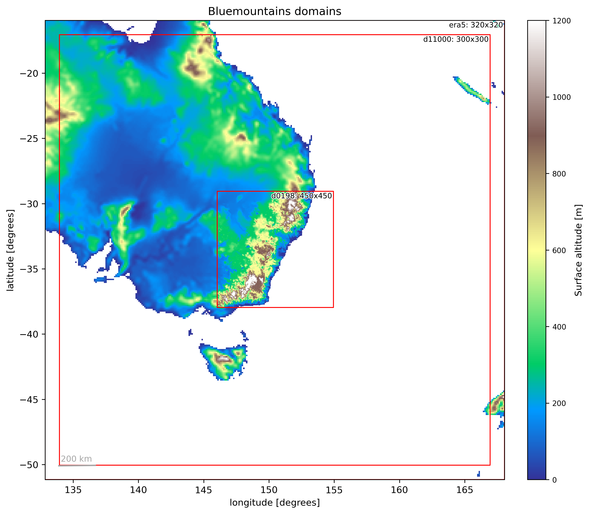

# RNS_Sydney_bushfire
Impact of megafires on weather

## Contributions
- Mathew Lipson: ancillary generation, initial model runs
- Abby Smyth: final model runs, analysis

## Configuration

Model: ACCESS-rAM (with OSTIA varying sea surface temperature)  
Model suite: https://code.metoffice.gov.uk/trac/roses-u/browser/d/r/2/1/6/trunk  
Period: 20200114T0000Z to 20200212T0000Z (30 days)  

Domain:
- Outer: GAL9 at 0.11° (~12.2 km) (BARRA-R2 initialised)
- Inner: RAL3p2 at 0.198° (~2.2km at equator)

## Ancillaries

Use u-dg767 with [this optional file](./ancils/rose-suite-rns_bluemountains.conf).
More info here: https://github.com/21centuryweather/RNS_Sydney_bushfire/tree/main/ancils

## Compute

Major tasks:

|               | y_npts | x_npts | nproc | CPUS | SU/12hrs | walltime/12hrs  |
|---------------|--------|--------|-------|------|----------|-----------------|
| ec_um_recon   |        |        |       | 192  | 96       | 1 min           |
| d11000 fcst   | 300    | 300    | 16x12 | 192  | 19       | 3 min           |
| d11000 recon  |        |        |       | 192  | 5        | 1 min           |
| d0198  fcst   | 450    | 450    | 24x24 | 576  | 230      | 12 min          |
| d0198  recon  |        |        |       | 192  | 8        | 1 min           |

### Total per day

- ~725 SU per day
- ~30 min walltime per day

## Experiments

Description of experiments

